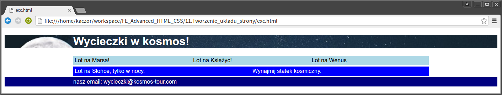

# Tworzenie układu strony

Utwórz stronę, jak na obrazku:



Wskazówki:

* obrazek tła w nagłówku: ```night-sky.jpg```,
* kolory: ```lightblue```, ```blue```, ```navy```,
* czcionka: Arial (nie zapomnij o alternatywach),
* zwróć uwagę na ```padding``` i ```margin``` na kolorowych paskach.
* Podziel stronę odpowiednio (section, header, footer)
